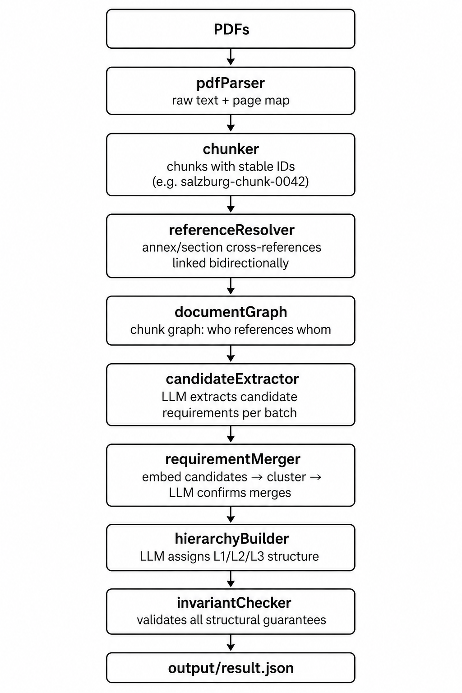

# tender-extractor

Extracts procurement requirements from tender PDFs into a structured 3 level tree of `ProcurementMatchDeliverable` objects.

---

## Setup

**Prerequisites**

```bash
# Node 20+
node --version

# pdftotext (used for PDF parsing)
sudo apt-get install -y poppler-utils
```

**Install**

```bash
git clone https://github.com/inquisitour/tender-extractor
cd tender-extractor
npm install --ignore-scripts
```

**Configure**

```bash
cp .env .env.local   # or just edit .env directly
```

Set your `DEEPSEEK_API_KEY` in `.env`. The other values can stay as defaults.

---

## Running

```bash
# Single PDF
npx tsx src/main.ts data/tender.pdf

# Multiple PDFs (main notice + annexes) (not tested)
npx tsx src/main.ts main.pdf annex-a.pdf annex-b.pdf

# Output is written to output/result_<timestamp>.json
```

Reruns are fast. PDF text, LLM responses, and embeddings are all cached under `.cache/` and only new work is billed.

**Spot-check a result:**

```bash
npx tsx src/main.ts --spot-check output/result_<timestamp>.json
```

This samples 20 random leaves and prints each one with its source chunks and a quality note, to sanity check consolidation quality by eye.

---

## Project structure

```
src/
├── ingestion/
│   ├── pdfParser.ts          # PDF --> text + page map (via pdftotext)
│   ├── chunker.ts            # text --> addressable chunks with stable IDs
│   └── cache.ts              # three layer cache (parsed / llm / embeddings)
├── graph/
│   ├── referenceResolver.ts  # bidirectional cross reference detection
│   └── documentGraph.ts      # chunk graph assembly
├── extraction/
│   ├── candidateExtractor.ts # LLM: chunks --> candidate requirements
│   ├── requirementMerger.ts  # embeddings + LLM: merge scattered references
│   ├── hierarchyBuilder.ts   # LLM: build L1/L2/L3 tree
│   └── llmClient.ts          # DeepSeek client with caching
├── prompts/
│   ├── extraction.ts         # extraction prompt (isolated, not inlined)
│   ├── merge.ts              # merge decision prompt
│   └── hierarchy.ts          # hierarchy assignment prompt
├── validation/
│   └── invariantChecker.ts   # formal output validation before write
├── evaluation/
│   └── spotCheck.ts          # manual QA tool
├── types/
│   └── procurement.ts        # ProcurementMatchDeliverable + Zod schema
├── utils/
│   └── logger.ts             # structured pino logger
└── main.ts                   # CLI entrypoint
```

---

## Pipeline



The key architectural decision is that the document graph is built **before** any extraction happens. Not extract first and deduplicate after. But understand the document structure first; which chunks reference which annexes, which sections continue across pages so when the LLM identifies a requirement it already has the related chunks in scope.

---

## Sample results

**Christmas Lights tender** (5 pages, English)
- L1 (7) - L2 (15) - L3 (42) leaves
- Invariants: 0 errors

**Salzburg Laboratory tender** (409 pages, German Leistungsverzeichnis)
- L1 (11) - L2 (141) - L3 (1666) leaves
- `REQ-0917` (Fume cupboard EN 14175): consolidated from **15 chunks** across the document
- `REQ-0998` (Lab swivel chair H75): consolidated from **12 chunks**
- `REQ-1075` (Exhaust connection): consolidated from **12 chunks**
- Invariants: 0 errors

---

## Design decisions

**Embeddings at candidate level, not chunk level.** The merger embeds extracted requirement descriptions, not raw text chunks. Two chunks can look very different in wording but describe the same obligation, embedding at the semantic unit (the requirement) gives the similarity signal more meaning.

**Two-stage merging.** Cosine similarity at threshold 0.82 finds candidate pairs cheaply. An LLM call then confirms each pair. This catches false positives (similar sounding but genuinely distinct requirements) that pure embedding clustering would miss.

**Prompts isolated in `src/prompts/`.** All three prompts (extraction, merge, hierarchy) live in their own files and are never inlined into logic. They can be read, reviewed, and tuned independently.

**Stable internal IDs (`REQ-xxxx`, `CAND-xxxx`).** Assigned at extraction time. The merger and hierarchy builder operate on IDs, not raw strings. The full chain (chunk --> candidate --> merged requirement --> tree leaf) is traceable end to end through the logs.

**Two-phase hierarchy for large documents.** Sending 1600+ requirements to the LLM in one call causes output truncation. The hierarchy step first establishes the L1 taxonomy from a 150-requirement sample, then runs batches of 200 constrained to that taxonomy. This keeps L1 categories consistent across batches regardless of document size.

**Invariant checker before write.** The validator runs before any output is written. It checks: every L3 leaf has ≥1 source chunk, every chunk ID resolves to real text, no duplicate requirement IDs, valid priority/confidence values throughout. Failures are logged as errors, not silently dropped.

**`LocaleObject<string>` — inferred definition.** Defined it as `Record<string, string>` keyed by BCP-47 language codes. The LLM is prompted to fill both `en` and `de` for every requirement. For English tenders the German is a translation; for German tenders the English is. Both should be treated as approximate.

---

## Known limitations

**Consolidation is conservative.** The 0.82 cosine threshold catches the clearest cases. On the Salzburg tender, ~6% of leaves have more than one source chunk, the true number is likely higher. Lowering the threshold would catch more merges at the cost of more LLM confirmation calls and a higher false-positive rate.

**Hierarchy batching can misplace requirements.** When the LLM assigns the same `REQ-xxxx` to two different L2 groups across separate batches, the deduplication guard keeps the first placement and warns on the second. Around 65 requirements were affected on Salzburg, they appear correctly in the tree but not necessarily in their optimal category.

**Section boundary detection is heuristic.** The chunker uses regex patterns tuned to Austrian tender position number formats (e.g. `GU.07.01.01.01`). This works well for the Salzburg Leistungsverzeichnis but would need adjustment for tenders with different structural conventions.

**No OCR.** `pdftotext` works on text-layer PDFs. Scanned documents without a text layer would need an OCR step upstream and confidence scoring would then be lower across the board, which the system would flag honestly.